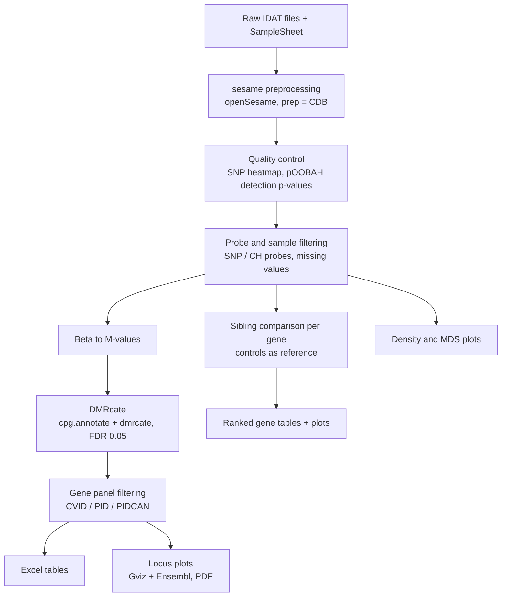

<div align="center">

# 🧬 Genome-wide DNA Methylation Analysis in CVID

**Illumina EPICv2 array · Differentially methylated regions · Immunodeficiency gene panels · Sibling-pair profiling**


-2b8cbe)


</div>

---

## 📖 Overview

This repository contains an R Markdown pipeline for analysing DNA methylation in patients with **common variable immunodeficiency (CVID)** compared with controls, using the **Illumina Infinium MethylationEPIC v2.0** array.

The workflow takes raw IDAT files through quality control and normalisation, calls **differentially methylated regions (DMRs)** genome-wide, and then zooms in on curated **CVID, PID and PIDCAN gene panels**. It also includes a **sibling-pair analysis** that compares two siblings gene by gene, using the unrelated controls as a reference for normal variation.

> ⚠️ **Status:** exploratory analysis. Findings are hypothesis-generating and should be validated before biological interpretation.

---

## 📑 Table of contents

- [Workflow at a glance](#-workflow-at-a-glance)
- [Quality-control thresholds](#-quality-control-thresholds)
- [Sibling-pair analysis](#-sibling-pair-analysis)
- [Getting started](#-getting-started)
- [Input files](#-input-files)
- [Outputs](#-outputs)
- [Limitations](#-limitations)
- [Data availability](#-data-availability-and-privacy)
- [Author](#-author)

---

## 🔬 Workflow at a glance



| # | Step | Tools |
|---|------|-------|
| 1 | **Import** sample sheet, build IDAT prefixes | base R |
| 2 | **Preprocess** raw signal to beta values | `sesame` (`CDB`) |
| 3 | **QC**: sample identity (SNP heatmap) and detection p-values (pOOBAH) | `sesame` |
| 4 | **Filter** failed probes/samples, SNP and non-CpG probes | `DMRcate::rmSNPandCH` |
| 5 | **Transform** beta values to M-values | `DMRcate` |
| 6 | **Differential methylation** Patient vs Control (`~ Sample_Group`) | `DMRcate`, `limma` |
| 7 | **Panel filtering** of DMRs by gene lists | `tidyverse` |
| 8 | **Visualise** density, MDS, and DMR locus tracks | `ggplot2`, `Gviz`, `AnnotationHub` |
| 9 | **Sibling analysis**: per-gene sibling difference ranked, with control values as reference | `tidyverse`, `ggplot2` |

---

## ✅ Quality-control thresholds

| Level | Criterion |
|-------|-----------|
| Detection | pOOBAH p-value > 0.05 → value masked as `NA` |
| Probe | Removed if detection fails in **> 20 %** of samples |
| Sample | Removed if **≥ 10 %** of probes fail detection |
| Probe | SNP-overlapping and non-CpG (CH) probes removed |
| Probe | Probes with any remaining `NA` removed |
| Replicates | EPICv2 replicate probes collapsed with `epicv2Filter = "mean"` |
| DMP calling | FDR threshold **0.05** |

---

## 👫 Sibling-pair analysis

**Question:** for the genes in our panels, how different are the two siblings (`MP11` and `MP12`) from each other?

### How it works

1. For every CpG that maps to a panel gene, the beta values of the two siblings are subtracted (`delta = sib1 - sib2`).
2. The unrelated controls (all `C` samples except the siblings) provide the **reference**: mean, SD, minimum and maximum for each CpG. Controls are **not** used to decide which genes are shown, only to judge whether a sibling difference is large compared with normal variation.
3. CpG-level results are summarised **per gene**, and **all panel genes are ranked** by their mean absolute sibling difference. No cutoff is used to remove genes.
4. Panel genes with no usable CpG after QC are listed separately, so every gene in the list is accounted for.

### Key columns in `gene_summary`

| Column | Meaning |
|--------|---------|
| `mean_abs_delta` | Mean absolute sibling difference over the gene's CpGs (**main ranking metric**) |
| `max_abs_delta` | Largest single-CpG sibling difference in the gene |
| `n_delta_ge_0.1`, `n_delta_ge_0.2` | Number of CpGs with a sibling difference ≥ 0.1 / ≥ 0.2 (shown for reference, not used as filters) |
| `sib1_mean`, `sib2_mean` | Mean beta of each sibling across the gene's CpGs |
| `ctrl_mean_gene` | Mean of the control means across the gene's CpGs |
| `ctrl_mean_range` | Average control spread (max − min) across the gene's CpGs |
| `delta_to_ctrl_range` | `mean_abs_delta / ctrl_mean_range`; values above 1 mean the sibling difference exceeds the spread seen among controls |
| `sib1_dist_ctrl`, `sib2_dist_ctrl` | Mean absolute distance of each sibling from the control mean |
| `n_sib1_outside`, `n_sib2_outside` | Number of CpGs where the sibling lies outside the control min–max range |

The Excel files also contain a `cpg_detail` sheet (one row per CpG with chromosome, position, gene region and CpG-island relation), a `genes_no_data` sheet, and a `legend` sheet describing every column.

### How to read the results

- **High `mean_abs_delta` and high `delta_to_ctrl_range`:** the siblings differ more than controls differ from each other, so the gene is worth a closer look.
- **High `mean_abs_delta` but also a wide control range:** the region is naturally variable, so the difference is less informative.
- **Both siblings outside the control range in the same direction:** a shared deviation. This is **not** captured by the sibling difference itself (the difference would be small), so check `n_sib1_outside` and `n_sib2_outside` as well.

> The sibling analysis is **descriptive**. With one pair there is no statistical test, so genes should be described as "most divergent between siblings", not as "significantly different".

---

## 🚀 Getting started

### 1. Requirements

- R (≥ 4.3) and RStudio
- Internet access on first run (reference data are downloaded by `sesameDataCache()` and AnnotationHub)

### 2. Install packages

```r
# Bioconductor
if (!requireNamespace("BiocManager", quietly = TRUE)) install.packages("BiocManager")
BiocManager::install(c(
  "sesame", "sesameData", "DMRcate", "limma", "GenomicRanges",
  "IlluminaHumanMethylationEPICv2anno.20a1.hg38",
  "IlluminaHumanMethylationEPICv2manifest",
  "Gviz", "AnnotationHub", "ensembldb"
))

# CRAN
install.packages(c(
  "tidyverse", "data.table", "writexl", "ggplot2",
  "ggrepel", "patchwork"
))
```

### 3. Run

The Rmd uses paths relative to the **parent** of the data folder (e.g. `metilasyon/SampleSheet.csv`). Set the working directory to the folder that *contains* `metilasyon/`, then:

```r
rmarkdown::render("metilasyon/mett.Rmd")
```

or run the document chunk by chunk in RStudio.

> 💡 `View()` calls only work interactively. Comment them out when knitting.

---

## 📂 Input files

```
projeler/
└── metilasyon/
    ├── mett.Rmd            ← analysis (this repository)
    ├── SampleSheet.csv
    ├── CVID.csv
    ├── PID.csv
    ├── PIDCAN.csv
    └── *_Grn.idat / *_Red.idat
```

### `SampleSheet.csv`

| Column | Description |
|--------|-------------|
| `Sentrix_ID` | Array barcode |
| `Sentrix_Position` | Position on the array, e.g. `R01C01` |
| `Sample_Name` | Unique sample label (used in plots) |
| `Sample_Group` | `P` (patient) or `C` (control) |

### Gene lists

`CVID.csv`, `PID.csv` and `PIDCAN.csv` each need a **`Gene`** column with HGNC gene symbols.

---

## 📊 Outputs

| Output | Content |
|--------|---------|
| `cvid_DMR_result.xlsx` · `pid_DMR_results.xlsx` · `pidcan_DMR_result.xlsx` | DMRs overlapping each gene panel |
| `CVID_All_Genes_Plots.pdf` · `PID_All_Genes_Plots.pdf` · `PIDCAN_All_Genes_Plots.pdf` | Genomic tracks per gene and DMR: Ensembl gene models, CpGs, DMRs, group methylation heatmaps and means |
| `sibling_CVID_full.xlsx` · `sibling_PID_full.xlsx` · `sibling_PIDCAN_full.xlsx` | Sibling comparison with `gene_summary` (ranked genes with control values), `cpg_detail`, `genes_no_data` and `legend` sheets |
| `sibling_*_top_genes.pdf` | Overview bar plot of the most divergent genes (bars: sibling difference, diamonds: control range) |
| `sibling_*_top_plots.pdf` | Per-gene CpG plots: control min–max band, control mean, sibling values (top 30 genes by default) |

---

## 🧭 Limitations

- **Confounders:** the model contains only the group variable. Cell-type composition, age, sex and batch are not adjusted for and can be strong confounders in blood-derived samples.
- **Relatedness:** the sibling pair is part of the main comparison without modelling the relationship.
- **Sibling analysis:** results are descriptive (one pair, no statistical test). The control range depends on the number of controls and is unstable when few controls are available. Sibling differences can also reflect genetic variation (e.g. meQTLs, SNPs near probes) rather than disease.
- **Annotation sources:** DMR gene overlap uses the DMRcate (Ensembl/GENCODE-based) annotation, whereas the sibling analysis uses the Illumina manifest (`UCSC_RefGene_Name`). Results may differ.
- **Panel selection:** gene panels are applied after genome-wide DMR calling, so panel-level findings should be interpreted as post hoc.
- **Reproducibility:** the latest Ensembl release is pulled from AnnotationHub at run time. Record `sessionInfo()` and the Ensembl version with your results.

---

## 🔒 Data availability and privacy

Raw IDAT files, sample sheets and per-patient result tables are **not** included in this repository because they contain patient-level data. Data access is subject to ethical approval and patient consent. For data-related requests, please contact the author.

---

## 👩‍🔬 Author


---

